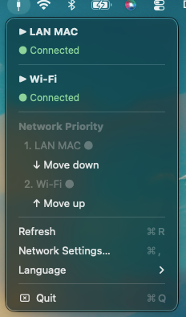
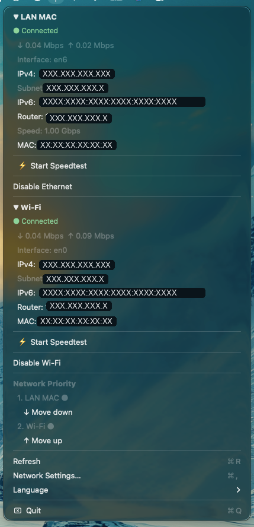

# EthernetStatus

**Menu bar network monitor for macOS** — see your active connection at a glance, run speedtests, and switch or reprioritize interfaces right from the menu bar.


Ever wished macOS had a real network display and some actual control — and found that most third-party apps just don't cut it? **EthernetStatus** lives in your menu bar: it shows your current preferred connection as an icon and lets you run speedtests, view your IP / router / MAC details, toggle interfaces on and off, and reprioritize networks — all without leaving the menu bar.

Give it a try and drop feedback to help improve it.

---

## Screenshots

| Menu bar icon | Collapsed menu | Expanded view |
|:---:|:---:|:---:|
|  |  |  |

The menu bar icon changes to reflect your current connection:

|  |  |  |
|:---:|:---:|:---:|
| **Ethernet / LAN active** | **Wi-Fi active** | **Nothing connected** |

---

## Features

- **Multi-interface monitoring** — Ethernet, Wi-Fi, iPhone USB & Personal Hotspot
- **Live throughput** — down/upload speed, refreshed every 5 seconds
- **Per-interface speedtest** — built on macOS's native `networkQuality`
- **Full connection details** — interface name, IPv4, subnet, IPv6, router, link speed and MAC address (all copyable)
- **One-click toggles** — enable/disable Ethernet or Wi-Fi straight from the menu
- **Network priority** — reorder interfaces with ↑ / ↓ to control which connection macOS prefers
- **Collapsible sections** — fold any section away to keep sensitive info hidden
- **Multilingual** — 🇩🇪 Deutsch · 🇬🇧 English · 🇫🇷 Français

### What the menu shows

```
▼ LAN MAC
  ● Connected
  ↓ 0.04 Mbps   ↑ 0.02 Mbps
  Interface:  en6
  IPv4:       XXX.XXX.XXX.XXX
  Subnet:     XXX.XXX.XXX.X
  IPv6:       XXXX:XXXX:XXXX:XXXX:XXXX:XXXX
  Router:     XXX.XXX.XXX.X
  Speed:      1.00 Gbps
  MAC:        XX:XX:XX:XX:XX:XX
  ⚡ Start Speedtest
  Disable Ethernet

▼ Wi-Fi
  ● Connected
  ↓ 0.04 Mbps   ↑ 0.09 Mbps
  Interface:  en0
  IPv4:       XXX.XXX.XXX.XX
  ...
  ⚡ Start Speedtest
  Disable Wi-Fi

Network Priority
  1. LAN MAC   ↓ Move down
  2. Wi-Fi     ↑ Move up

Refresh            ⌘R
Network Settings…  ⌘,
Language           ▸
Quit               ⌘Q
```

*(values above are placeholders — your real addresses are shown in the app)*

---

## Installation

> **Note:** EthernetStatus is not (yet) code-signed or notarized by Apple, so macOS Gatekeeper will block it on first launch. That's why the first start uses a right-click → **Open**. The app only reads local network status and runs Apple's own `networkQuality` tool — it sends nothing anywhere. If you'd rather verify that yourself, the full source is right here in the repo.

### Step 1 — Install the app
1. Open `EthernetStatus-1.0.dmg`
2. Drag **EthernetStatus.app** into your **Applications** folder
3. Eject the DMG

### Step 2 — Launch the app
1. **Right-click** EthernetStatus.app in Applications
2. Choose **Open**, then click **Open** again in the dialog
3. The icon appears in the menu bar (top right)

### Step 3 — Autostart (optional, recommended)
1. **Double-click** `autostart-cmd.command`
2. Click **Open** in the Terminal prompt if asked
3. The app now launches automatically at every login and restarts itself after a crash

---

## Uninstall

1. In the menu bar, choose **Quit**
2. Open Terminal and run:
   ```bash
   launchctl unload ~/Library/LaunchAgents/com.user.ethernetstatus.plist
   rm ~/Library/LaunchAgents/com.user.ethernetstatus.plist
   ```
3. Delete **EthernetStatus.app** from your Applications folder

---

## Requirements

- macOS 13 (Ventura) or later

---

## Feedback

Found a bug or have an idea? [Open an issue](../../issues) — feedback is very welcome.

---

## License

Released under the [MIT License](LICENSE). Do what you like with it; just keep the copyright notice, and no warranty is provided.
